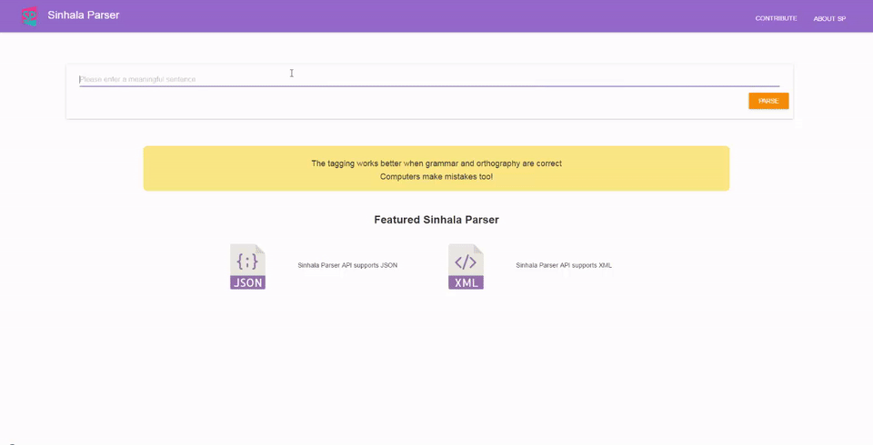

# Sinhala Parser



### Setting up Docker Environment
[See how to install Docker on Ubuntu](https://www.digitalocean.com/community/tutorials/how-to-install-and-use-docker-on-ubuntu-16-04#step-2-—-executing-the-docker-command-without-sudo-(optional))

[Install Docker on Windows](https://docs.docker.com/docker-for-windows/)

### Create Docker Image for the API
```bash
cd server
docker build -t <your username>:SinhalaParser .
```
### Run Docker Container 

```bash
docker run -p <port wish to bind>:8080 -d <your username>:SinhalaParser
```
